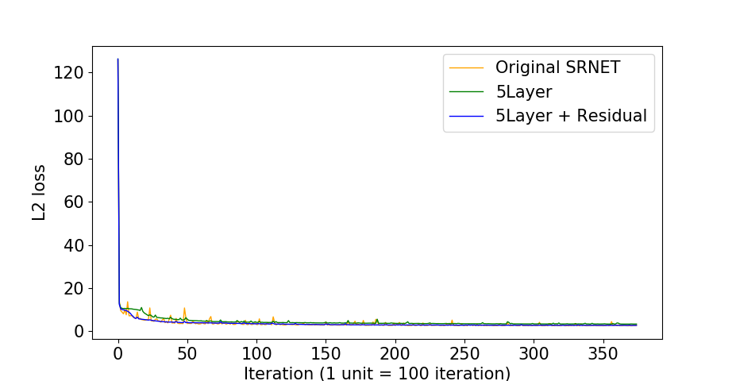
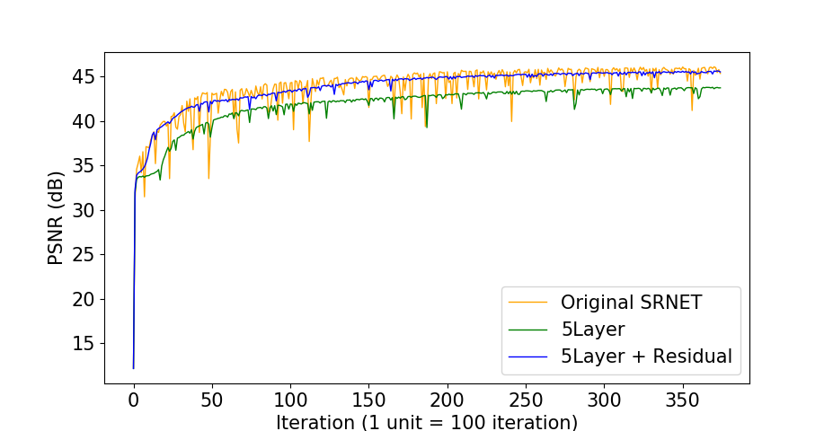

LungCT Super Resolution
=====

Result
-----
|Loss|PSNR|
|:---:|:---:|
|||   

Figure 1. The graph of training process. The lower L2 loss and the higher PSNR is better than not.    

|Loss|PSNR|
|:---:|:---:|
|||  

Figure 2. Comparison of three architecture. The 'Origianl SRNET' is proposed by Chao Dong et al. and other two architecture is developed in this study. The '5 Layer' architecture has more non-linear combination than 'Origianl SRNET' and it has smaller kernel. Because, it reduces not only the distortion of the edges of the image but also number of parameters. However, it cannot fitting the training data well that is reason of using 'Residual' architecture. It enhanced the PSNR than '5 Layer' architecture and also recude oscillation than 'Origianl SRNET'.

|Low resolution|Reconstruction (PSNR:44.51 dB)|High resolution|
|:---:|:---:|:---:|
||||  

Figure 3. The sample reconstruction CT. First image of Figure 3 looks like blurry iamge however middle image is significantly clear than first one. The middle image also very simmilar with original High-resolution image.  

Reference
-----
[1] Dong, C., Loy, C. C., He, K., & Tang, X. (2016). Image super-resolution using deep convolutional networks, IEEE,  https://ieeexplore.ieee.org/abstract/document/7115171/  
[2] Grove, O., Berglund, A. E., Schabath, M. B., Aerts, H. J., Dekker, A., Wang, & Eikman, E. (2015). Quantitative computed tomographic descriptors associate tumor shape complexity and intratumor heterogeneity with prognosis in lung adenocarcinoma, PloS one, http://journals.plos.org/plosone/article?id=10.1371/journal.pone.0118261  
