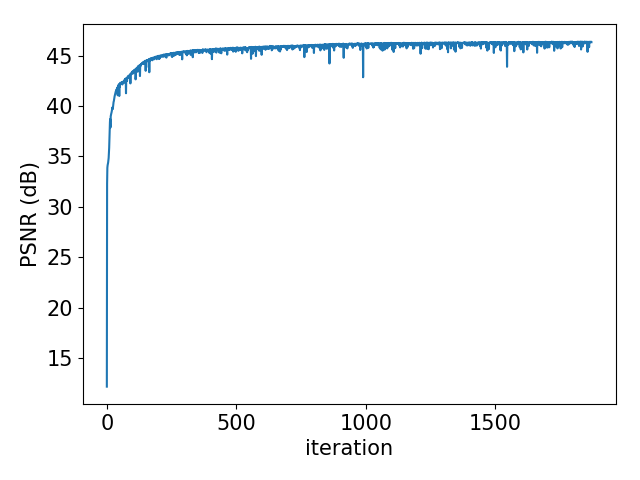

LungCT Super Resolution
=====

Result
-----
|Loss|PSNR|
|:---:|:---:|
|||  

Figure 1. The graph of training process.  

|Low resolution|Reconstruction (PSNR:44.51 dB)|High resolution|
|:---:|:---:|:---:|
||||  

Figure 2. The sample reconstruction CT.  

Reference
-----
[1] Dong, C., Loy, C. C., He, K., & Tang, X. (2016). Image super-resolution using deep convolutional networks, IEEE,  https://ieeexplore.ieee.org/abstract/document/7115171/  
[2] Grove, O., Berglund, A. E., Schabath, M. B., Aerts, H. J., Dekker, A., Wang, & Eikman, E. (2015). Quantitative computed tomographic descriptors associate tumor shape complexity and intratumor heterogeneity with prognosis in lung adenocarcinoma, PloS one, http://journals.plos.org/plosone/article?id=10.1371/journal.pone.0118261  
