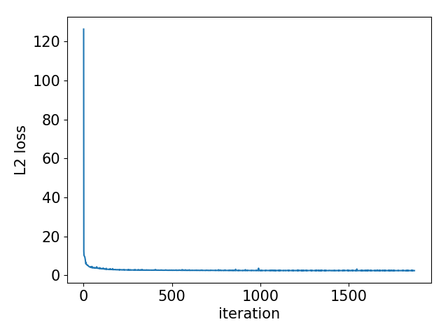

LungCT Super Resolution
=====

Dataset
-----
Olya Grove et al., LungCT-Diagnosis, http://journals.plos.org/plosone/article?id=10.1371/journal.pone.0118261

Result
-----
|Loss|PSNR|
|:---:|:---:|
|||  

Figure 1. The graph of training process.  

|Low resolution|Reconstruction (PSNR:44.51 dB)|High resolution|
|:---:|:---:|:---:|
||||  

Figure 2. The sample reconstruction CT.  
